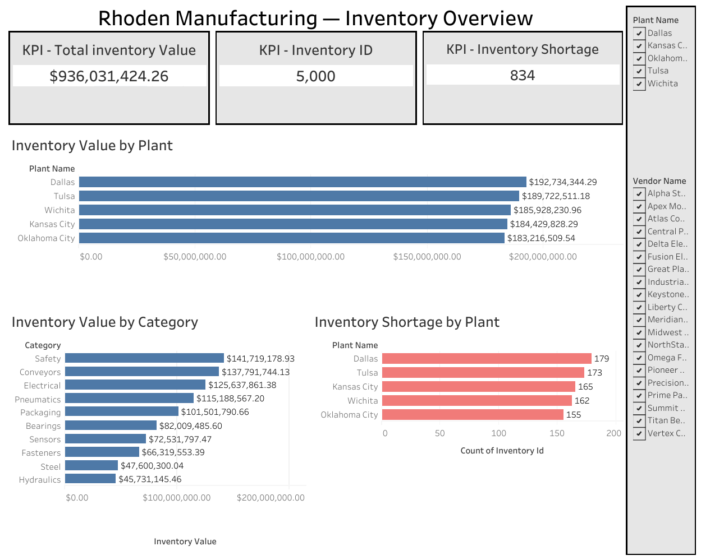
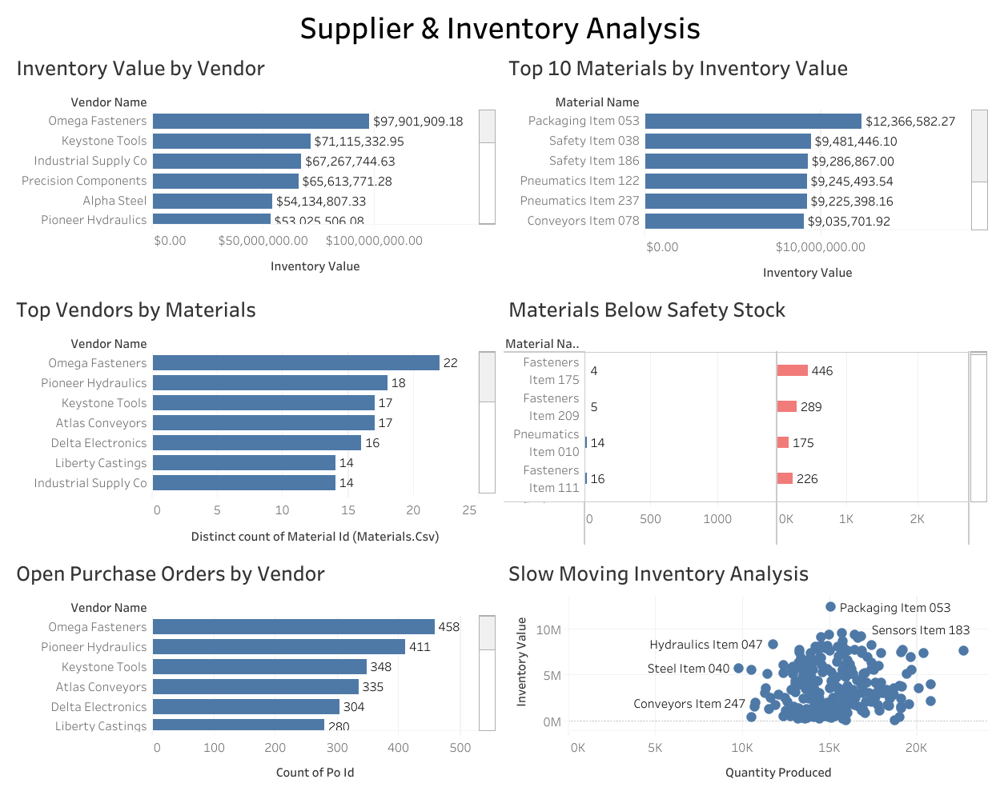

# Rhoden ERP Inventory Analysis

## Overview

This project analyzes manufacturing ERP data to evaluate inventory levels, supplier relationships, plant performance, inventory risks, and opportunities to improve inventory management.

SQL queries were developed to answer business questions related to inventory value, inventory shortages, supplier usage, safety stock levels, and slow-moving materials. The results were then visualized in Tableau dashboards to provide a business-focused view of inventory and supplier performance.

## Tools Used

- SQL
- BigQuery
- Tableau
- Visual Studio Code

## Project Structure

- `documentation/` - Project documentation, including the 10 business requests analyzed
- `sql/` - SQL queries used to answer each business request
- `images/` - Tableau dashboard screenshots and selected BigQuery query-result screenshots
- `README.md` - Project overview and documentation

## Database Tables Used

- Materials
- Inventory
- Vendors
- Plants
- Purchases
- Production

## Business Questions Analyzed

This project answers 10 operational business requests related to:

- Inventory records by plant
- Inventory value by plant
- Inventory value by vendor
- Materials below safety stock
- Open purchase orders by vendor
- Inventory value by category
- Top materials by inventory value
- Top vendors by number of materials
- Inventory shortages by plant
- Slow-moving inventory

## Business Requests

The full list of business questions and their business value is documented here:

[View Business Requests](documentation/business_requests.md)

## Tableau Dashboards

The analysis was visualized through two Tableau dashboards designed to provide a clear view of inventory and supplier performance.

### Inventory Overview

The Inventory Overview dashboard provides visibility into inventory value, inventory shortages, inventory by category, and key inventory performance indicators. Plant and vendor filters allow users to interact with the analysis.

### Supplier & Inventory Analysis

The Supplier & Inventory Analysis dashboard examines supplier relationships, inventory value, material concentration, safety stock risks, purchase orders, and slow-moving inventory. Plant and vendor filters allow users to explore the analysis interactively.

## SQL Analysis

The SQL queries used to perform the analysis are available in the `sql/` folder.

Each query corresponds to one of the 10 business requests documented in the project.

## Key Findings

### 1. Inventory Concentration by Plant

Inventory value was analyzed across manufacturing plants to identify where the greatest amount of inventory investment is concentrated. This analysis provides visibility into where company capital is tied up in inventory and helps identify plants that may warrant additional inventory management attention.

### 2. Supplier Inventory Exposure

Inventory value was analyzed by vendor to identify suppliers associated with the largest inventory investment. This provides insight into supplier relationships with significant financial impact and can support purchasing, supplier management, and inventory planning decisions.

### 3. Inventory Risk

Materials below safety stock levels and inventory shortages were analyzed to identify potential operational risks across manufacturing plants. These results help highlight materials that may require replenishment and locations where inventory shortages could affect production or operations.

### 4. Slow-Moving Inventory

Slow-moving inventory was analyzed to identify materials with limited movement that may be tying up working capital. Identifying these materials can help support decisions related to inventory reduction, purchasing, and more efficient use of storage space and capital.

## Skills Demonstrated

- SQL querying and data analysis
- BigQuery
- Relational database joins
- Aggregation and grouping
- Inventory analysis
- Supplier analysis
- Business question development
- Data visualization
- Tableau dashboard development
- Dashboard filtering and user interaction
- Data storytelling
- Business-focused analytical thinking
